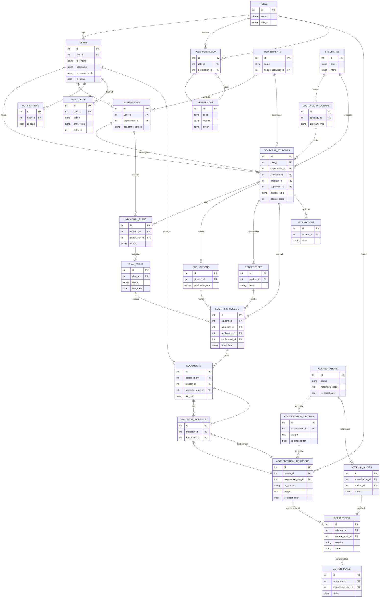

# 02. Ma'lumotlar bazasi ER diagrammasi

**ADPI Doktorantura monitoringi va maxsus davlat akkreditatsiyasiga tayyorgarlik axborot tizimi**

Ushbu hujjat tizimning to'liq relatsion sxemasini tavsiflaydi: 24 ta jadval, ularning ustunlari, birlamchi kalitlari (PK), tashqi kalitlari (FK) va o'zaro bog'lanish turlari (1:M, M:N). Barcha ustun turlari **portativ** (PostgreSQL/MySQL'ga ko'chiriladigan) qilib tanlangan.

> Turlar bo'yicha kelishuv: `id` — INTEGER (autoincrement / SERIAL), `*_id` — INTEGER FK, matnlar — TEXT/VARCHAR, sana-vaqt — TIMESTAMP, mantiqiy qiymat — BOOLEAN (SQLite'da INTEGER 0/1), pul/foiz — REAL/DECIMAL.

---

## 1. Jadvallar ro'yxati (24 ta)

| № | Jadval (entity) | Vazifasi |
|---|-----------------|----------|
| 1 | `users` | Tizim foydalanuvchilari |
| 2 | `roles` | Foydalanuvchi rollari (9 ta) |
| 3 | `permissions` | Ruxsatlar (modul + amal) |
| 4 | `role_permission` | **M:N** pivot: rollar <-> ruxsatlar |
| 5 | `doctoral_students` | Doktorantlar (tayanch/mustaqil izlanuvchi) |
| 6 | `supervisors` | Ilmiy rahbarlar/maslahatchilar |
| 7 | `departments` | Kafedralar |
| 8 | `specialties` | Ixtisosliklar |
| 9 | `doctoral_programs` | Doktorantura dasturlari |
| 10 | `individual_plans` | Individual rejalar |
| 11 | `plan_tasks` | Reja vazifalari |
| 12 | `publications` | Ilmiy maqolalar |
| 13 | `conferences` | Konferensiyalar (ma'ruzalar) |
| 14 | `scientific_results` | Ilmiy natijalar (umumlashtiruvchi) |
| 15 | `attestations` | Attestatsiyalar |
| 16 | `accreditations` | Akkreditatsiya sikllari |
| 17 | `accreditation_criteria` | Akkreditatsiya mezonlari |
| 18 | `accreditation_indicators` | Akkreditatsiya indikatorlari |
| 19 | `indicator_evidence` | **M:N** pivot: indikatorlar <-> hujjatlar (dalillar) |
| 20 | `documents` | Hujjatlar/fayllar (dalillar bazasi) |
| 21 | `internal_audits` | Ichki auditlar |
| 22 | `deficiencies` | Kamchiliklar |
| 23 | `action_plans` | Chora-tadbir rejalari |
| 24 | `notifications` | Bildirishnomalar |
| 25 | `audit_logs` | Audit jurnali (o'zgarmas) |

> Eslatma: ro'yxatda `role_permission` va `indicator_evidence` pivotlari 24 ta asosiy obyekt ichida (M:N bog'lovchi jadvallar sifatida) hisobga olingan; ular topshiriqning 21-bandidagi obyektlar to'plamiga to'liq mos keladi.

---

## 2. Jadval tafsilotlari (ustunlar, PK, FK)

### 2.1 `users`
| Ustun | Tur | Izoh |
|-------|-----|------|
| id | INTEGER | **PK** |
| role_id | INTEGER | **FK** -> roles.id |
| full_name | TEXT | To'liq ism |
| username | TEXT | Login (unique) |
| email | TEXT | Unique |
| password_hash | TEXT | `password_hash` natijasi |
| is_active | BOOLEAN | Faol/nofaol |
| created_at, updated_at | TIMESTAMP | |

**Bog'lanish:** `roles` 1:M `users`.

### 2.2 `roles`
| id INTEGER **PK** | name TEXT (unique, masalan `super_admin`) | title_uz TEXT | description TEXT | created_at TIMESTAMP |

**Bog'lanish:** M:N `permissions` (`role_permission` orqali); 1:M `users`.

### 2.3 `permissions`
| id INTEGER **PK** | code TEXT (unique, masalan `doctoral_students.create`) | module TEXT | action TEXT (view/create/edit/approve/upload/configure/audit) | description TEXT |

### 2.4 `role_permission` (M:N pivot)
| id INTEGER **PK** | role_id INTEGER **FK** -> roles.id | permission_id INTEGER **FK** -> permissions.id |
Unique (role_id, permission_id). **Bu roles <-> permissions M:N bog'lanishini amalga oshiradi.**

### 2.5 `doctoral_students`
| id INTEGER **PK** | user_id INTEGER **FK** -> users.id (ixtiyoriy) | full_name TEXT | student_type TEXT (tayanch_doktorant / doktorant / mustaqil_izlanuvchi) | department_id INTEGER **FK** -> departments.id | specialty_id INTEGER **FK** -> specialties.id | program_id INTEGER **FK** -> doctoral_programs.id | supervisor_id INTEGER **FK** -> supervisors.id | enrollment_year INTEGER | course_stage INTEGER (kurs/bosqich) | status TEXT | created_at, updated_at TIMESTAMP |

### 2.6 `supervisors`
| id INTEGER **PK** | user_id INTEGER **FK** -> users.id (ixtiyoriy) | full_name TEXT | academic_degree TEXT (ilmiy daraja) | academic_title TEXT (ilmiy unvon) | department_id INTEGER **FK** -> departments.id | created_at TIMESTAMP |

### 2.7 `departments`
| id INTEGER **PK** | name TEXT | code TEXT | head_supervisor_id INTEGER **FK** -> supervisors.id (kafedra mudiri, ixtiyoriy) | created_at TIMESTAMP |

### 2.8 `specialties`
| id INTEGER **PK** | code TEXT (masalan shifr) | name TEXT | branch TEXT (fan sohasi) | created_at TIMESTAMP |

### 2.9 `doctoral_programs`
| id INTEGER **PK** | specialty_id INTEGER **FK** -> specialties.id | name TEXT | program_type TEXT (PhD/DSc) | duration_years INTEGER | created_at TIMESTAMP |

### 2.10 `individual_plans`
| id INTEGER **PK** | student_id INTEGER **FK** -> doctoral_students.id | supervisor_id INTEGER **FK** -> supervisors.id | academic_year TEXT | start_date, end_date DATE | status TEXT (draft/approved/in_progress/completed) | approved_by INTEGER **FK** -> users.id | created_at, updated_at TIMESTAMP |

**Bog'lanish:** `doctoral_students` 1:M `individual_plans`; `individual_plans` 1:M `plan_tasks`.

### 2.11 `plan_tasks`
| id INTEGER **PK** | plan_id INTEGER **FK** -> individual_plans.id | title TEXT | description TEXT | task_type TEXT | due_date DATE | status TEXT (planned/in_progress/done/overdue) | completed_at TIMESTAMP | created_at TIMESTAMP |

### 2.12 `publications`
| id INTEGER **PK** | student_id INTEGER **FK** -> doctoral_students.id | title TEXT | journal TEXT | publication_type TEXT (scopus/wos/oak/local) | published_at DATE | doi TEXT | created_at TIMESTAMP |

### 2.13 `conferences`
| id INTEGER **PK** | student_id INTEGER **FK** -> doctoral_students.id | title TEXT | conference_name TEXT | level TEXT (xalqaro/respublika/mahalliy) | location TEXT | event_date DATE | created_at TIMESTAMP |

### 2.14 `scientific_results`
| id INTEGER **PK** | student_id INTEGER **FK** -> doctoral_students.id | plan_task_id INTEGER **FK** -> plan_tasks.id (ixtiyoriy) | result_type TEXT (publication/conference/patent/monograph/other) | publication_id INTEGER **FK** -> publications.id (ixtiyoriy) | conference_id INTEGER **FK** -> conferences.id (ixtiyoriy) | title TEXT | achieved_at DATE | verified BOOLEAN | created_at TIMESTAMP |

> `scientific_results` — ilmiy natijalarni umumlashtiruvchi jadval; u maqola/konferensiya kabi manbalarga bog'lanadi va DALIL (documents) hamda AKKREDITATSIYA INDIKATORI bilan zanjirni ta'minlaydi.

### 2.15 `attestations`
| id INTEGER **PK** | student_id INTEGER **FK** -> doctoral_students.id | period TEXT (masalan yillik/oraliq) | attestation_date DATE | result TEXT (passed/failed/conditional) | commission_notes TEXT | created_by INTEGER **FK** -> users.id | created_at TIMESTAMP |

### 2.16 `accreditations`
| id INTEGER **PK** | title TEXT | cycle_year TEXT | scope TEXT | status TEXT (planning/in_progress/submitted/completed) | readiness_index REAL (hisoblangan foiz) | is_placeholder BOOLEAN | created_at, updated_at TIMESTAMP |

**Bog'lanish:** `accreditations` 1:M `accreditation_criteria`.

### 2.17 `accreditation_criteria`
| id INTEGER **PK** | accreditation_id INTEGER **FK** -> accreditations.id | code TEXT | name TEXT | weight REAL (sozlanadigan og'irlik) | display_order INTEGER | is_placeholder BOOLEAN | created_at TIMESTAMP |

**Bog'lanish:** 1:M `accreditation_indicators`. Og'irlik (weight) va tartib administrator tomonidan sozlanadi.

### 2.18 `accreditation_indicators`
| id INTEGER **PK** | criteria_id INTEGER **FK** -> accreditation_criteria.id | code TEXT | requirement TEXT (talab) | description TEXT | weight REAL (sozlanadigan) | rag_status TEXT (green/yellow/red/grey) | score REAL | target_value TEXT | actual_value TEXT | responsible_role_id INTEGER **FK** -> roles.id | is_placeholder BOOLEAN | created_at, updated_at TIMESTAMP |

**Bog'lanish:** M:N `documents` (`indicator_evidence` orqali); 1:M `deficiencies`.

### 2.19 `indicator_evidence` (M:N pivot)
| id INTEGER **PK** | indicator_id INTEGER **FK** -> accreditation_indicators.id | document_id INTEGER **FK** -> documents.id | note TEXT | linked_by INTEGER **FK** -> users.id | linked_at TIMESTAMP |
Unique (indicator_id, document_id). **Bu documents <-> indicators M:N bog'lanishini amalga oshiradi.**

### 2.20 `documents`
| id INTEGER **PK** | title TEXT | file_path TEXT (storage/ ichida) | mime_type TEXT | file_size INTEGER | doc_type TEXT | uploaded_by INTEGER **FK** -> users.id | student_id INTEGER **FK** -> doctoral_students.id (ixtiyoriy) | scientific_result_id INTEGER **FK** -> scientific_results.id (ixtiyoriy) | created_at TIMESTAMP |

**Bog'lanish:** M:N `accreditation_indicators` (`indicator_evidence` orqali).

### 2.21 `internal_audits`
| id INTEGER **PK** | accreditation_id INTEGER **FK** -> accreditations.id | title TEXT | audit_date DATE | auditor_id INTEGER **FK** -> users.id | scope TEXT | status TEXT (planned/in_progress/completed) | summary TEXT | created_at TIMESTAMP |

**Bog'lanish:** 1:M `deficiencies`.

### 2.22 `deficiencies`
| id INTEGER **PK** | indicator_id INTEGER **FK** -> accreditation_indicators.id (ixtiyoriy) | internal_audit_id INTEGER **FK** -> internal_audits.id (ixtiyoriy) | title TEXT | description TEXT | severity TEXT (low/medium/high) | status TEXT (open/in_progress/resolved) | identified_by INTEGER **FK** -> users.id | identified_at DATE | created_at TIMESTAMP |

**Bog'lanish:** 1:M `action_plans`.

### 2.23 `action_plans`
| id INTEGER **PK** | deficiency_id INTEGER **FK** -> deficiencies.id | title TEXT | description TEXT | responsible_user_id INTEGER **FK** -> users.id | due_date DATE | status TEXT (planned/in_progress/done/overdue) | completed_at TIMESTAMP | created_at TIMESTAMP |

### 2.24 `notifications`
| id INTEGER **PK** | user_id INTEGER **FK** -> users.id | type TEXT | title TEXT | body TEXT | link TEXT | is_read BOOLEAN | created_at TIMESTAMP |

### 2.25 `audit_logs` (o'zgarmas)
| id INTEGER **PK** | user_id INTEGER **FK** -> users.id | action TEXT (create/update/upload/approve/delete) | entity_type TEXT | entity_id INTEGER | old_values TEXT (JSON) | new_values TEXT (JSON) | ip_address TEXT | created_at TIMESTAMP |

---

## 3. Bog'lanishlar xulosasi

**1:M (bir-ko'p) bog'lanishlar:**
- roles 1:M users
- departments 1:M supervisors, 1:M doctoral_students
- specialties 1:M doctoral_programs, 1:M doctoral_students
- doctoral_programs 1:M doctoral_students
- supervisors 1:M doctoral_students, 1:M individual_plans
- doctoral_students 1:M individual_plans, publications, conferences, scientific_results, attestations, documents
- individual_plans 1:M plan_tasks
- accreditations 1:M accreditation_criteria, 1:M internal_audits
- accreditation_criteria 1:M accreditation_indicators
- accreditation_indicators 1:M deficiencies
- internal_audits 1:M deficiencies
- deficiencies 1:M action_plans
- users 1:M notifications, 1:M audit_logs, 1:M documents

**M:N (ko'p-ko'p) bog'lanishlar:**
- roles <-> permissions  → pivot: `role_permission`
- accreditation_indicators <-> documents  → pivot: `indicator_evidence`

---

## 4. Mermaid ER diagramma

---

## 5. Zanjir bilan bog'liqlik (22-band)

Ma'lumotlar modeli quyidagi markaziy zanjirni to'liq qo'llab-quvvatlaydi:

`doctoral_students` → `individual_plans`/`plan_tasks` → `scientific_results` (`publications`/`conferences`) → `documents` (DALIL) → monitoring (RAG) → `accreditation_indicators` → `deficiencies` (KAMCHILIK) → `action_plans` (CHORA-TADBIR) → `internal_audits` (NAZORAT) → hisobotlar.
